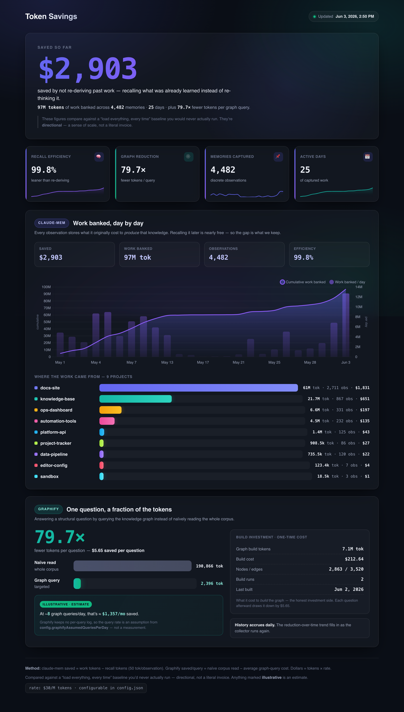

# Token Savings

> See how many tokens — and dollars — `claude-mem` and Graphify save you, in one good-looking dashboard.



A self-contained, dark-mode dashboard that turns two Claude Code context tools into a single number you can actually read: **how much work they've banked, and roughly what that's worth.** It opens straight from disk — no server, no build step, no npm install, no account. It auto-detects what you have installed and quietly skips what you don't.

---

## What it shows

Two panels, each from a real tool on your machine:

- **claude-mem** — your memory system. Every observation it stores carries the number of tokens it cost to *originally* produce that knowledge; sum those and you get **work banked**. Recalling it later is nearly free, so the saving is `work − recall`. The panel shows banked work, a **daily trend**, and a **per-project breakdown**.
- **Graphify** — a knowledge graph over a repo. Answering a structural question through the graph costs a fraction of reading the whole codebase (often a **~79.7× reduction**). The panel shows **per-query reduction** plus a **build ledger** (the one-time token cost of building the graph).

Up top: the **headline dollars saved**, summed across both tools.

> **One honesty note, said plainly:** every figure is measured against a "load everything, every time" baseline you'd never actually run. The numbers are **directional, not an invoice.**

---

## Quick start

```bash
git clone https://github.com/BespokeWoodcraftStudio/claude-token-savings-dashboard.git
cd claude-token-savings-dashboard
./install.sh           # checks prereqs, runs the collector, opens the dashboard
```

`install.sh` verifies your prerequisites, runs the collector once, and opens `index.html` in your browser.

Prefer to do it by hand? Two commands:

```bash
node collect-savings.mjs && open index.html
```

(On Linux, swap `open` for `xdg-open`.) The collector reads your `claude-mem` database and your Graphify output, then writes `data/savings.js` — the page loads that via a plain `<script>` tag, so there's no fetch and no server involved.

---

## Keep it fresh automatically

Add a Claude Code **`SessionStart` hook** so the collector re-runs every time you open Claude in a repo. Drop this into your project's `.claude/settings.json` (point the path at wherever you cloned this):

```json
{
  "hooks": {
    "SessionStart": [
      {
        "hooks": [
          {
            "type": "command",
            "command": "node \"$CLAUDE_PROJECT_DIR/PATH/TO/collect-savings.mjs\" >/dev/null 2>&1 || true"
          }
        ]
      }
    ]
  }
}
```

It's fire-and-forget: if anything's missing it exits quietly (`|| true`) and never blocks your session. There's also an optional **Claude Code skill** in [`skill/`](skill/) that wires this up for you and refreshes the dashboard on demand.

---

## Configure

Everything lives in `config.json`. The most useful keys:

| Key | What it does |
|-----|--------------|
| `dollarsPerMillionTokens` | Blended $/million-tokens rate used for every dollar figure (default `30`). Pick the rate that matches the tier you mostly run. |
| `recallTokensPerObservation` | Recall-cost model: `saved = work − observations × this` (default `50`). |
| `scope.mode` / `scope.projects` | `global` = every project in the DB; `projects` = only the names you list. |
| `claudeMemDbPath` | Path to the `claude-mem` SQLite DB (default `~/.claude-mem/claude-mem.db`; supports `~` and relative paths). |
| `graphify.graphPath` | Path to your `graphify-out/graph.json`. Relative paths resolve from where you run the collector. |
| `highlightProjects` | Project names to pin/highlight in the per-project breakdown. |

Full annotated reference with every key explained: **[`config.example.json`](config.example.json)**.

---

## How the numbers work

- **claude-mem:** `saved_tokens = Σ discovery_tokens − (observations × recallTokensPerObservation)`, then `$ = saved_tokens / 1e6 × dollarsPerMillionTokens`. Efficiency is capped at **99.9%** — we never show a fake 100%.
- **Graphify:** `saved_per_query = naïve_corpus_tokens − avg_query_tokens`; the one-time build cost comes from `graphify-out/cost.json`. Any monthly projection is labelled **"illustrative"** because Graphify keeps no per-query log.

Both panels compare against a baseline you'd never really run, so treat the totals as directional. Full walkthrough: **[`docs/HOW-IT-WORKS.md`](docs/HOW-IT-WORKS.md)**.

---

## Requirements

- **Node 18+**
- The **`sqlite3` CLI** on your PATH
- **At least one** of:
  - `claude-mem` — with its DB at `~/.claude-mem/claude-mem.db` (or wherever you point `claudeMemDbPath`), **or**
  - `graphify` — with a built graph at `graphify-out/graph.json`

The dashboard **auto-detects** both tools and **degrades gracefully**: if a tool isn't installed or has no data, its panel shows a friendly "not detected" state while the other panel renders normally. No demo or placeholder data is ever shown.

---

## FAQ

**Does it phone home?**
No. Everything runs locally and the page opens straight from disk (`file://`). There's no server, no `fetch()`, no telemetry, no account.

**I only have one of the tools — does it still work?**
Yes. Install either `claude-mem` or `graphify` and that panel renders. The missing one simply shows "not detected."

**Are the dollar amounts real?**
They're an **estimate** at a rate *you* set (`dollarsPerMillionTokens`), measured against a "load everything, every time" baseline you'd never actually run. Useful as a directional signal — not an invoice.

**Where does the data live?**
On your machine. The collector writes `data/savings.js` / `data/savings.json`, both of which are **gitignored** — they're machine-specific snapshots rebuilt on every run.

**Does it work on Linux?**
Yes — macOS and Linux are both supported. (Use `xdg-open` instead of `open` to launch it.)

**Do I need to install npm packages?**
No. The collector shells out to the `sqlite3` and `graphify` CLIs you already have. Chart.js is vendored in [`vendor/`](vendor/). Zero `npm install`.

---

## More

- **[`docs/INSTALL.md`](docs/INSTALL.md)** — full install + setup walkthrough
- **[`docs/HOW-IT-WORKS.md`](docs/HOW-IT-WORKS.md)** — the formulas, the baseline, and the caveats in detail
- **[`CONTRIBUTING.md`](CONTRIBUTING.md)** — how to help out

Built for the **Claude Code** ecosystem. **MIT licensed.**
